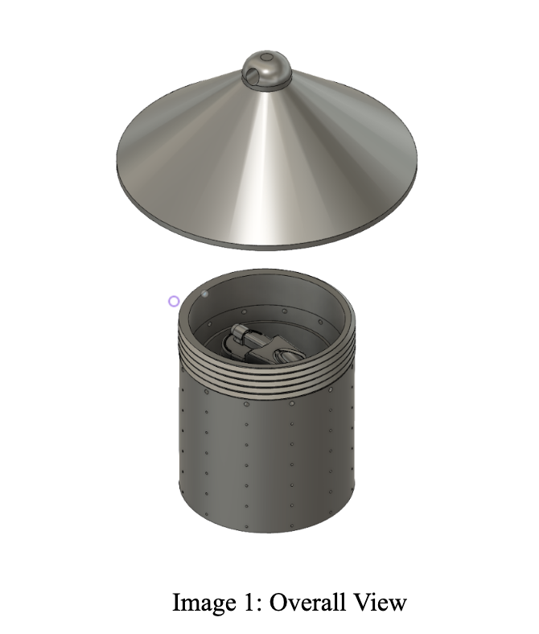

In our Intro to Mechanical Design (MAE 2250) class, we were tasked with developing a solution to address the growing population of the invasive Spotted Lanternfly. Since 2014, spotted lanternflies (SLF) have permeated through the north east, feeding on produce such as grapes and infecting over 70 plant species, threatening agriculture and biodiversity. The economic impacts of this invasive species have been estimated at $324 million annually.

So far, we are in the conceptual stage of defining our problem and brainstorming solutions.

[Client Pitch](#client-outline-and-pitch)

[Functional Prototype](#functional-prototype)

## Client Outline and Pitch:

**Proposed Solutions for Managing Spotted Lanternflies in Vineyards**

**Team:** Lanternfly Bye-Bye

**Client(s):** Cornell CALS Extension / E\&J Gallo Winery / National Grape  

   Since 2014, spotted lanternflies (SLF) have permeated the northeast, feeding on produce such as grapes and infecting over 70 plant species, threatening agriculture and biodiversity. In 2025, the National Association of American Wineries valued New York’s wine industry at $16.81 billion. This high-value industry has been impacted by SLF, who damage grapevines and contaminate harvest. Below are two ideas our group has for addressing the issue. We appreciate any feedback you have for us.

### Poisonous Tree of Heaven
Our first idea focuses on managing the population of spotted lanternflies using a decoy tree of heaven. Our team would design a small container and fill it with a mix of tree of heaven sap and a toxin. Attracted by the sap, the lanternflies will dig into the container and ingest the toxin. Otherwise, the container can be equipped with a weight-activated nozzle that would douse the lanternflies in a toxic mix, similar to what many households currently use. The benefits of this product are the decoys are easily scalable and stackable, and they are able to protect the harvesters from the lanternflies while also working to reduce the fly population. By the end of the semester, our goal is to have a finalized trap and, ideally, have tested it in a real environment to see its effectiveness. 

### Essential Oils
Our second proposal attempts to prevent the spotted lanternflies from entering the vineyard by dettering them with essential oils.  By creating individual diffusers to place around the vineyard, the flies will not enter, and the plants will remain unharmed. Ideally, this idea could be developed to include a way to harm the lanternflies as well as deter them in order to help control the population and further protect the vineyard. This product would be nontoxic to surrounding plants and other animals, and would not require much maintence while protecting harvesters from the lanternflies.

### Key risks / unknowns

- Placement of the products is crucial. Because we are using a two-step solution, including attraction and detraction, we want to make sure we detract the flies into the attraction termination sites and not the other way around. Due to our budget and time constraints, we will have to rely on secondary research and data such as wind speed and direction.

-  Plant-safe compounds. Both of our proposed solutions involve liquid compounds to deter and remove lanternflies. The compounds used in the final solution will need to be safe for the grapes and approved by the FDA.

### Questions for the client
1. **Have you found anything that is effective at killing spotted lanternflies?**  
   *Decision affected: What measure to use to narrow down the population (toxins, phsyical means, etc)*
2. **Are spotted lanternflies deterred by other factors such as locations of the vineyards or human presence?**  
   *Decision affected: How to best implement our product* 
3. **Are there any parts of our plans that raise conerns for you?**  
   *Decision affected: Next steps* 

### References

- “New York Wine Industry - WineAmerica Economic Impact Study.” 2025. WineAmerica. WineAmerica Mobile. May 29, 2025. https://wineamerica.org/economic-impact-study-2025/new-york-wine-industry-2025/.

- “Spotted Lanternfly Reported Distribution Map.” 2017. CALS. 2017. https://cals.cornell.edu/integrated-pest-management/outreach-education/whats-bugging-you/spotted-lanternfly/spotted-lanternfly-reported-distribution-map.

- “Spotted Lanternfly in Perspective (U.S. National Park Service).” n.d. Www.nps.gov. https://www.nps.gov/articles/000/slf-in-perpective.htm.

## Functional Prototype

### Prototype Assembly 
1. Gently press the motion sensors into the holes in the lid. Thread the wiring through the lid, ensuring connection is maintained between the sensors and the arduino.
2. Attach the bottle/nozzle connector to the spray bottle and the rest of the electronics in the center area of the base. Make sure that the arduino can rest on and activate the spray bottle.
3. Fill the outer area of the base with Tree of Heaven Sap or your preferred Spotted Lanternfly Attractor.
4. Thread the nozzles into the connector and through the outer holes of your choice.
5. Twist the lid onto the base and hang where desired.
 
### Success Criteria

The goal of our project is to effectively deter and eliminate 75% of Spotted Lanternflies within a vineyard before they reach the harvesters. Our product is a Tree of Heaven trick that attracts the flies with Tree of Heaven sap and through motion sensors sprays them with a damaging mixture. With our first functional prototype, we aimed to validate the core systems: motion detection, actuation, fluid delivery, and structural design, against measurable success criteria that directly support this goal.

1. Motion Sensor Reliability
   Assessed: The ability of the system to consistently detect Spotted Lanternflies as they land..
   Measurement: Percentage of successful sensor detections that trigger an LED light at a fixed distance (~6 inches).
   Target: ≥75% detection success rate.
   Result from testing: Achieved ~100% success rate across four sensors.
   Relevance to goal: Reliable detection is critical to ensuring flies are targeted before reaching crops.
2. Servo Activation 
   Assessed: If detected motion can successfully trigger the servo motor and spray mechanism.
   Measurement: Percentage of motion detections that result in correct servo actuation.
   Target: ≥75% successful actuation.
   Result from testing: ~50% success rate (limited by coding errors).
   Relevance to goal: This directly determines whether detected flies can actually be sprayed and eliminated.
3. Spray System Effectiveness 
   Assessed: Ability of the system to deliver pressurized liquid through multiple nozzles simultaneously.
   Measurement: Number of nozzles (target = 4) that can be supplied with sufficient pressure and coverage distance (~5 inches).
   Target: Functional delivery to all 4 nozzles at usable pressure.
   Result from testing: System functional, but insufficient pressure and setup for 4 nozzles simultaneously.
   Relevance to goal: Effective spray coverage is necessary to ensure flies are hit and eliminated.
4. Structural Integrity and Manufacturability 
   Assessed: Whether the housing can be accurately printed, assembled, and support system components.
   Measurement: Dimensional accuracy (fit of parts), successful assembly, and absence of structural defects.
   Target: Fully assembled prototype with precise component fit.
   Result from testing: Individual parts printed accurately with full assembly in the future.
   Relevance to goal: A durable and scalable housing is necessary for real vineyard usage..

For our live demonstration, we identified the detection-to-spray response as the most critical to show, as it validates our full system performance. By simulating Spotted Lanternflies, we hope to show a ≥75% success rate of identifying and accurately dousing any motion during the live demonstration.